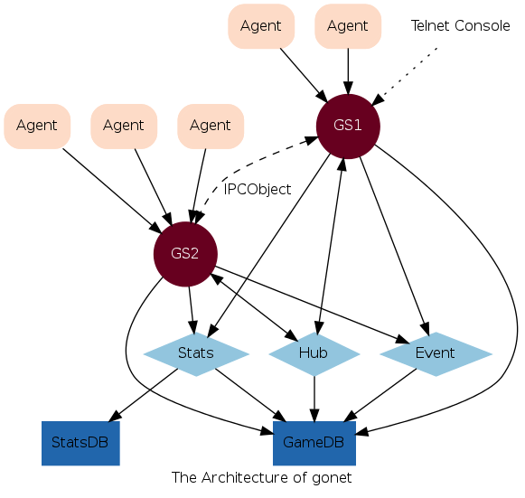

###A game server skeleton implemented with golang.

#### 部署:     
* Game Server(GS):  
玩家直接连接GS， 处理玩家逻辑，并与 HUB/SS 通信，GS存在若干个。     
  
* Hub Server(HUB):  
若干个GS 连接到一个HUB, 只存在一个HUB，维护基础的全局信息，以及 GS<--->GS 的消息转发.  
    
* Stats Server(SS):     
统计服务器，根据玩家的行为，记录策划需要的数据，以便于后期统计。     
统计属于事后分析，数据量较大，性能需求不同, 故单独列为一个服务器。

#### 通信原则:     
1.  GS到HUB/SS的通信，都是Call同步调用，即GS必须等待ACK。         
2.  HUB到GS的通信，只有forward数据包。       
3.  单播消息在玩家离线时会存入db, 登录后的启动过程 ___GS___ 直接读取db，并forward给玩家goroutine。(持久化)       
4.  多播消息会发送给所有的在线玩家(非持久化)       
5.  广播消息会发送给所有的在线玩家(非持久化)       

#### 服务器状态一致性
1.  GS节点可以单独重启    
2.  HUB 重启后，GS必须全部重启    
3.  SS 可随意重启，不影响业务         

#### 安装先决条件:
0. 确保安装好bzr, graphviz, gawk
1. 确保安装好mongodb
2. 确保config.ini中的mongo_xxxx配置正确
3. export GOPATH='当前目录'

#### 安装:
* xtaci@ubuntu:~$ git clone https://github.com/xtaci/gonet       
* xtaci@ubuntu:~$ cd gonet        
* xtaci@ubuntu:~/gonet$ export GOPATH=~/gonet       
* xtaci@ubuntu:~/gonet$ go get labix.org/v2/mgo      
* xtaci@ubuntu:~/gonet$ make    
* xtaci@ubuntu:~/gonet$ ./start-test.sh
